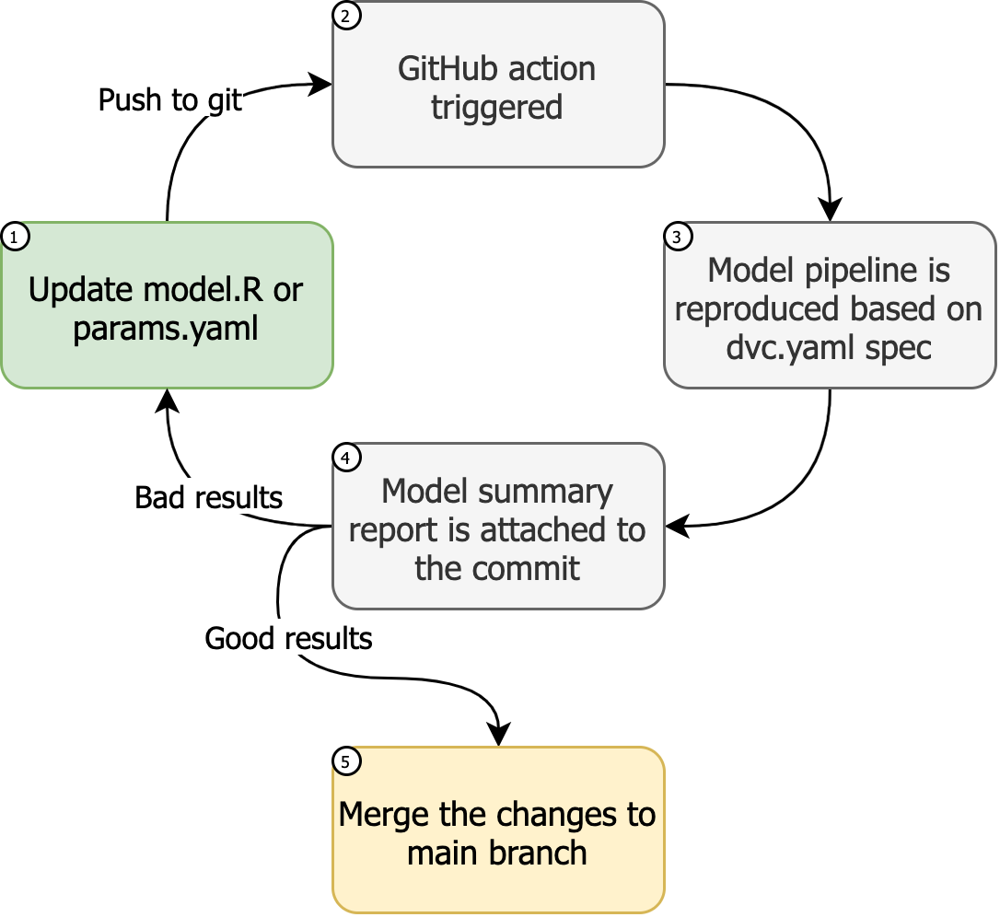

# mlops

<!-- badges: start -->

<!-- badges: end -->

The goal of mlops is to provide an example of [`cml`](https://github.com/iterative/cml), [`dvc`](https://github.com/iterative/dvc), and [`tidymodels`](https://github.com/tidymodels/tidymodels) all working in tandem to support a machine learning pipeline. Additionally, this pipeline uses a private [`s3`](https://aws.amazon.com/s3/) bucket as the data source.

For an example, see the existing pull request(s) in this repository.

